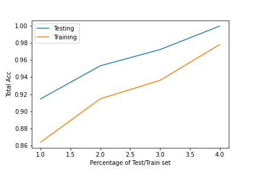

# DecisionTree

## Used Google Colab to learn
Part of an assignment for Machine Learning and Knowledge Discovery
Create a Decision Tree and train in on the UCI car data
Randomly select 20%, 40%, 60%, and 80% as your training set, and the rest are your test set.
Repeat 10 times and average the test results.

Instead I averaged the accuracy scores since it should reflect the results.

## Plotting the test accuracy trends

